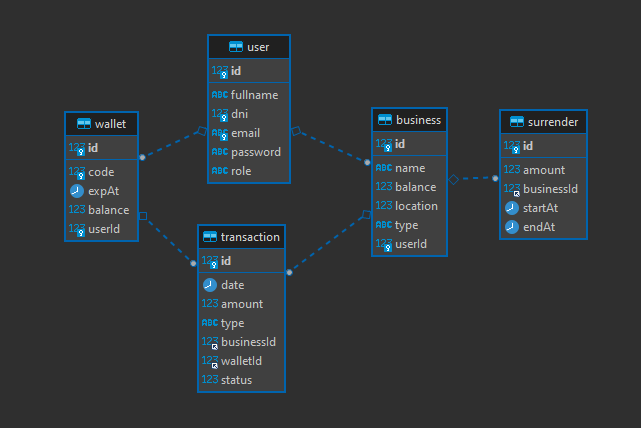

# Consumo en Evento - API 💻 

Módulo 6: Proyecto back-end - Express.

Grupo 4: Choque, Cruz, Torrejon, Corimayo, Martinez

## Ejecutar el proyecto 📋

*Setear las variables de entorno copiando del archivo .env.template a un nuevo archivo .env

Instalar la base de datos con docker-compose (_tener previamente instaldo y corriendo [Docker](https://docs.docker.com/get-docker/)_),  ejecutar el siguiente comando desde la
ubicación del archivo docker-compose.yml

```
docker-compose up -d
```

Instalar las dependencias del proyecto.

```
npm install
```

Correr el proyecto.

```
npm run dev
```

## Construido con 🔧

* [NodeJs](https://nodejs.org/en)
* [Doker](https://docs.docker.com/)
* [ExpressJs](https://expressjs.com/es/)
* [TypeORM](https://typeorm.io/)
* [JWT](https://jwt.io/)
* [Nodemailer](https://nodemailer.com/)

## Diagrama BD 📚

<p align="center" >
     
</p>
